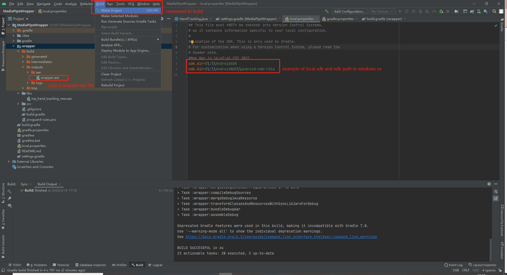

# MediaPipe Wrapper

This MediaPipe Wrapper communicates between the Portal-ble application and the MediaPipe AAR. Parts of this source code is originally from MediaPipe's [multi-hand tracking gpu demo](https://github.com/google/mediapipe/tree/master/mediapipe/examples/android/src/java/com/google/mediapipe/apps/handtrackinggpu), and modified to work with Portal-ble on Unity.

MediaPipe is a general computer vision library, and MediaPipe AAR is the build needed to run on Android. If you instead wish to build the MediaPipe AAR in addition to this wrapper, please see MediaPipe's [android_archive_library.md](https://github.com/google/mediapipe/blob/master/docs/getting_started/android_archive_library.md).

# Prerequisites

You'll need to [download and install Android Studio](https://developer.android.com/studio/install) first, along with the associated Android SDK

## Build a Unity wrapper that allows hand tracking in Unity/Android

From the menu bar, select "Build -> Make Project".

The Gradle build tool version is specified in `build.gradle`, and Android Studio may ask you to update it. However, versions higher than 3.6.0 will raise an error or warnings about broken local .aar files. There doesn't seem to be a way to update the version of Gradle without causing this problem, so version 3.5.2 is used based on the official MediaPipe configuration.

Each time after the MediaPipe Wrapper is built, you will need to delete the extra "AndroidManifest.xml" file in the built AAR file to prevent a conflict between MediaPipe AAR and Wrapper AAR. To do this, open `MediaPipeWrapper/wrapper/build/outputs/aar/wrapper.aar` as a zip file, and extract to a folder. Then similarly open up `classes.jar` in the extracted file as a zip file, and extract to another folder. Delete the `AndroidManifest.xml` in the folder extracted from `classes.jar` and zip the files back together as a new `classes.jar`. Then place the zipped up `classes.jar` in the extracted `wrapper.aar` folder, and zip those files up as a new `wrapper.aar`, and replace the original `wrapper.aar` with this new one.

Key files:
1. [HandTracking.java](wrapper/src/main/java/com/example/wrapper/HandTracking.java) builds up an Android Archive Library which provides MediaPipe hand tracking plugins in Unity.
2. The output wrapper aar file gets built to this path: `MediaPipeWrapper/wrapper/build/outputs/aar/wrapper.aar`.
3. [MediaPipe library file](wrapper/libs/mp_hand_tracking.aar). You can use our pre-built file or follow [these instructions](https://google.github.io/mediapipe/getting_started/android_archive_library.html) to build your own.

| File                            | Usage                           |
|---------------------------------|---------------------------------|
|[mp_hand_tracking.aar](wrapper/libs/mp_hand_tracking.aar)|MediaPipe Android Archive Library|
|[hand_landmark.tflite](wrapper/src/main/assets/hand_landmark.tflite)|Hand landmark DL light model|
|[hand_tracking_mobile_gpu.binarypb](wrapper/src/main/assets/hand_tracking_mobile_gpu.binarypb)|Hand tracking DL graph for mobile GPU|
|[palm_detection.tflite](wrapper/src/main/assets/palm_detection.tflite)|Hand bounding box detection DL light model|
|[arm64-v8a libopencv_java3.so](wrapper/src/main/jniLibs/arm64-v8a/libopencv_java3.so)|arm64-v8a opencv library for java|
|[HandTracking.java](wrapper/src/main/java/edu/brown/cs/portalble/wrapper/HandTracking.java)|Hand tracking wrapper main function|
|[BmpProducer.java](wrapper/src/main/java/edu/brown/cs/portalble/wrapper/BmpProducer.java)|Parallel bitmap producer|
|[CustomFrameAvailableListner.java](wrapper/src/main/java/edu/brown/cs/portalble/wrapper/CustomFrameAvailableListner.java)|Abstract class for frame input event listener|
|[MpExternalTextureConverter.java](wrapper/src/main/java/edu/brown/cs/portalble/wrapper/MpExternalTextureConverter.java)|Convert camera texture to MediaPipe DL model texture|
|[MpExternalTextureRender.java](wrapper/src/main/java/edu/brown/cs/portalble/wrapper/HandTracking.java)|Render external texture to frame buffer|
|[MyGLThread.java](wrapper/src/main/java/edu/brown/cs/portalble/wrapper/MyGLThread.java)|Thread implementation for parallelism and concurrency|
