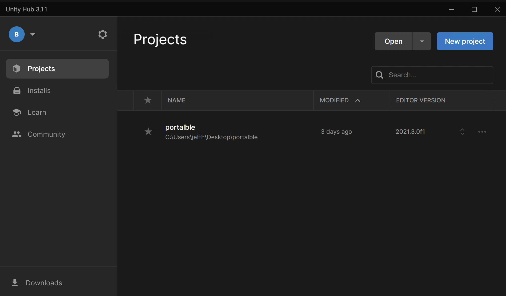
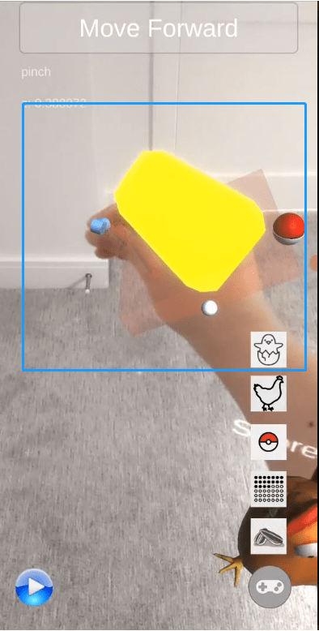
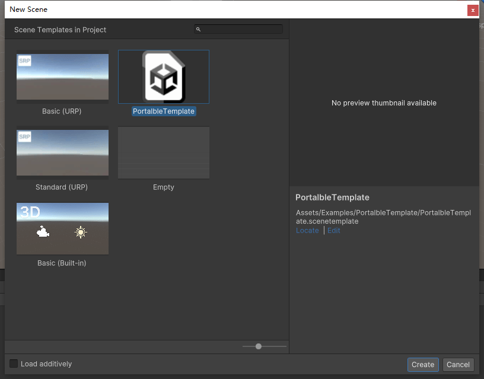

# Portal-ble

Portal-ble is a library that allows you to directly manipulate virtual objects in a smartphone augmented reality (AR)
environment with your bare hands. Basically, it's hand tracking so you can reach into augmented reality to play with virtual things in 3D space. The Portal-ble techniques try to make the interactions as intuitive as possible.

 

This repository hosts the version of Portal-ble that requires only a smartphone, and not any other hardware like a depth sensor or wrist display or augmented reality glasses. This basic smartphone-only release currently supports Android only and runs as a Unity application; iOS support is still under development. Because there is no true depth sensing, it relies on MediaPipe's computer vision capabilities which are less accurate, so some patience is required. It also only works with the standard back-facing camera at this time, so has a modest field of view and care needs to be taken to ensure your hand remains within the camera's view; hopefully in the future, the ultra-wide lenses that already exist on many Android phones can be used for augmented reality so this becomes less of a limitation.

Your Android should be at least version 7.0 (Nougat) with the latest "Google Play Services for AR" (formerly called AR Core) installed, which may be installed by default. MediaPipe is connected to Unity using our wrapper library. This version has been tested on the following Android phones: Samsung Galaxy 10+, Google Pixel 3, Google Pixel 4, Google Pixel 6, Google Pixel 6 Pro. The current library does not support Samsung S9/S9+ due to its limited shader compatibility.

For more information, [see the Portal-ble website](https://portalble.cs.brown.edu) and subscribe to the [email list](https://docs.google.com/forms/d/e/1FAIpQLSeTCgnwF1gjrc1O8mfJ_5TmT_TLowFQ2DUhsollmqPG84pAFQ/viewform?usp=pp_url&entry.1299571007=Portal-ble:+touchable+mixed+reality+(including+our+hardware+AR+projects)&entry.1760653896=portal-ble+github) for updates

## Install

### Step 1: Prerequisites

Download and install:
- Unity Version: 2021.3.0f1, along with everything part of the Unity Android Build Support tools
- Android SDK (Version > 29): We recommend that you install this together with Unity Hub

### Step 2: Clone the repository to your computer
	git clone git@github.com:brownhci/portalble.git

### Step 3: Use Unity Hub to open the project folder that you have just cloned

## Quick Start: Build an Example Application

### Step 4: Open an example scene in Unity

The example scenes are in `Assets/Examples/`, where there is a Chicken scene, two Grab scenes, and a PortalbleTemplate. For your first build, consider the simplest scene, `Assets/Examples/Grab/PortalbleHelloWorld.Unity`. To start, you must load this scene by opening it, before building the application.

### Step 5: Connect your phone to the computer to build and run directly (optional)
- Connect your phone to the computer, and [enable developer options](https://developer.android.com/studio/debug/dev-options)
- Turn on [USB debugging] (https://developer.android.com/studio/debug/dev-options) on the phone
- Grant access to your computer when prompted

### Step 6: Build for Android
 

- 1: Check that the scene you want to build is listed here, if not, check that the scene is open and click the "Add Open Scenes" button.
- 2: In Build Settings, switch to the **Android** Platform
- 3: In the same Build Settings window, open Player Settings, select XR Plug-in Management, then **uncheck** and *check** the two checkboxes, *Initialize XR on Startup* and *ARCore*. If you skip this step, you might not see the camera feed on your phone.
- 4: *Build* or *Build and Run* (for testing, select the *default compression* mode for faster deployment time)

### Step 7: Run the app

If you have connected the phone to your computer and selected *Build and Run*, then the example application should be running on your phone. If you are just building the apk file to install afterwards, then you should be able to transfer it to the Android phone now, to install and run it. For Android 12 or later,  wireless transfer of the APK file may not be an option, and you may need to connect your phone to the computer via a USB cable for file transfer.

Keep in mind you will need to have enabled the option on your Android phone to install apps from unknown sources. If the app still doesn't install, it's possible that there is an instance already installed (perhaps even on another account on the phone), so you will have to uninstall that version of the app first.

### Step 8: HelloWorld Experience

Once you start the `PortalbleHelloWorld` on your phone, you should see the screen below. Please look around with your phone and **try to keep it leveled** for the best experience.

Then, a metalic planet appears, you may approach it until the distance indicator turns blue and the popup reads ''Feel it with your hand''.

At this point, try to stretch the hand that is not holding the phone and bring your phone **as close to your body as possible** (while the screen is still visible) for the best hand detection range. Once our hand reaches the object, a blue highlight appears, and you may use your hand to rotate the planet or use a pinch gesture to move it around.

It is essential to perform hand tracking while holding the phone as close to you as possible (Left figure below); otherwise, you may **experience difficulties grabbing virtual objects.** (Right figure below)

## Example Applications

`PortalbleHelloWorld.Unity` is the simplest example, and just showcases an existing object and the ability to grab it, without any need to scan the background. Aside from the `PortalbleHelloWorld.Unity` example, there are two other examples: `Assets/Examples/Chicken/Chicken.Unity` and `Assets/Examples/Grab/PortalbleGrab.Unity`

The PortalbleGrab example demonstrates a simple object grabbing application. First scan the floor to create a horizontal plane where objects can sit. Place a cheese cube in the AR environment and grab it with your hand. This simple example should let you see what it's like to manipulate a virtual object with your hand and experience the visual and haptic feedback. There is a record/stop button to record hand interactions for replay and debugging in the bottom left corner, and a toggle for showing the floor plane.

The Chicken example is more interactive, allowing you to place chickens and their eggs in the scene. You can drop food that attracts the chickens. Scanning the floor correctly is important here, so that the chickens and food do not fall infinitely. See [this video](https://www.youtube.com/watch?v=Oh4ozN8g_3o&t=6s) to watch us feed and pet the chicken.

There are five functional buttons in the right-bottom corner of the screen:

- Spawn the chicken: pressing this button will spawn the chicken out from the egg.

- Grow the chicken: pressing this button will increase the size of the chicken.

- Play with throwing: perform a "Pinch" gesture while pressing this button will generate a pokemon ball on your hand. Throw it to feel the virtual physics! (You can't capture a chicken with a pokemon ball right?)

- Hide AR plane: pressing this button will hide the AR plane (white dots) and pressing it again will show them. Make sure you scan the surface first to generate a place to for AR

- Feed the chicken: do "Pinch" and pressing this button will generate a corn seed on your hand; drop it and the chicken will come.

  

#### Recording Hand Movement

You can record your 3D hand coordinates using the recording button on the left bottom corner, which may be useful for debugging or replays. The tracking hand's movement and rotation will be recorded between "Start" and "End". In the end, you can retrieve these recording files from the Internal Storage on your phone. The files are saved in the app folder `/Android/data/portalble/` in a comma-separated value (.csv) format.

- start: pressing this button will change it to "End" icon and recording will start.
- end: pressing this button will change it to "Start" icon and recording will end.

  

# Making a Custom Application
This section has two subsections; please read both to get a custom application running.

## System Overview and Functions

### Unity Files
- [Process.cs](Assets/PortalbleCore/MediaPipe/Scripts/Core/Process.cs): It receives a copy of the camera feed from ARFoundation and sends it to the MediaPipe AAR for processing. It also updates the skeleton model in Unity once it receives the hand, joint coordinates callback.

- Hand_r and Hand_l: these two are hand instances (GameObjects in Unity) that represents the hand skeleton for your right hand (Hand_r) and left hand (Hand_l), respectively.

- SVMCalculator.cs: This class predicts five different gestures using the skeleton projection features from Hand_r and Hand_l, see [our paper for details](https://jeffhuang.com/papers/Portalble_UIST19.pdf); this SVM uses the histogram intersection as the kernel.

### Android MediaPipe Components
- MediaPipe AAR: MediaPipe is built from the source code as of February 2022 for 3D hand tracking.
- MediaPipe Wrapper AAR: This wrapper contains API channels to communicate a Unity scene. It also pre-processes raw MediaPipe data for the pipeline.
- If you wish to build the MediaPipe Wrapper and MediaPipe AAR from source rather than use our pre-built AAR files located in `Assets/Plugins/Android/`, please see [the MediaPipeWrapper README](MediaPipeWrapper).

### Supported Gestures
While Portal-ble with depth sensor supports five gestures, this version supports three: "Pinch", "Palm", "idle".
- pinch (default): used for grabbing the virtual object.
- palm: used for releasing the virtual object, can also be used to pet the virtual chicken.
- idle: used for releasing the virtual object.

  

### Grab & Touch
You can interact with virtual objects by reaching with your hand directly. There will be highlighting and vibration effects when you reach the virtual object.

- Grab: grab happens when you do "Pinch" while touching an object
- Touch: touch happens when your hand enters the margin of an object
- Pet is a specific animation you can trigger with touch (third image)

## Setup your Unity Scene
Please use our PortalbleTemplate highlighted in Step A below for a new scene in Unity. This is an essential step in creating hand interactive AR objects.
### Step A: Click "File -> New Scene", choose PortalbleTemplate and then click create.

Here, we create the folder under Assets/Examples/MyScene.

### Step B: Add the 3D object for interaction with the scene.
You may add any 3D object to the scene. Here we create a cube called "MyCube." Choose "MyCube" and then click "Portalble -> Set Grabbable" in the window bar. The default "MyCube" should have a scale of (1,1,1), equivalent to a 1m x 1m x 1m cube in AR; adjust that scale to your desire on the Unity's Inspector.

*ATTENTION*: If you import a compound 3D object (e.g., a tree, a house, a machine, etc.), you need to set up grabbable for any **child within that 3D object that contains 3D mesh**. Otherwise, your 3D object will not be interactive.

The Set Grabbable function transforms custom 3D objects into the free-hand interactive object in AR (i.e., you can now grab them). You should see two new components added to the 3D GameObject(i.e., RigidBody and Grabbable.cs) and a new child (GameObject::GrabCollider). By default, there is no need to change any of the components, but if you wish to customize them, their functions are explained in the following:

- Rigibody: ensures that your 3D GameObject interacts with the physics engine
- Grabbable.cs: enables grabbing and interaction states on a GameObject.
- GrabCollider: the GameObject determines the collision states between your hand and the game object, storing the current interaction state of a GameObject (grabbed or not), and helps to decide the grabbing order during a multi-object scenario.

### Step C: Dynamically place your GameObject in AR Runtime

At this point, your GameObject "MyCube" is interactive. Now we want to dynamically place it in the AR scene. To do so, we need to create a prefab first. This can be achieved by dragging "MyCube" into the project folder, as indicated in the figure below. This action automatically creates a new prefab.

Then select DemoController in the Hierarchy, and drag the new prefab to the Inspector -> ''Place Prefab'' as indicated in the figure below. This action allows you to place your 3D objects in AR.

### Step D (Optional): Customize Depth Indicator
Portal-ble comes with accommodation and feedback to help users find depth. You may want to change or toggle them as needed. Here's how to do this for the relevant components.

#### Turn On and Off

In `Process.cs`, find the following member functions:

`InitializeIndicator()` turns on the distance indicator to show the depth while a user attempts to grab a virtual object. Remove this function to disable the Indicator.

<pre>
		 Indicator Off 			  Indicator On (Green)		   	  Indicator On (Blue)
</pre>

To customize the effect of the Indicator, locate **IndicatorManager** in the Hierarchy and on its Inspector:
- Indicator Prefab: The current Arc effect is used to indicate distance.
- Backup Prefab: A fall-back mechanism in case the AR effect fails.
- Track Start Distance: Any GameObject within this range will be affected by the depth indicator. The unit is in meters.
- Sound Cylinder Radius: The threshold determine the radius of a cylinder-casting selection for auditory feedback; see our UIST 2019 paper for details.
- Screen Text: Text output on the top of the smartphone's screen.

`InitializeHighlight()` turns on the virtual object's highlight depth indicator when a user grabs a virtual object. Remove this function to disable the highlight. The highlight is shown in these images as an especially large blue container in this image, but is much smaller by default.

<pre>					Highlight Off				Highlight On</pre>

All set! You've made your first interactive augmented reality application.

Now go to Step 5 above in the Install section to build and run the application on your phone.
